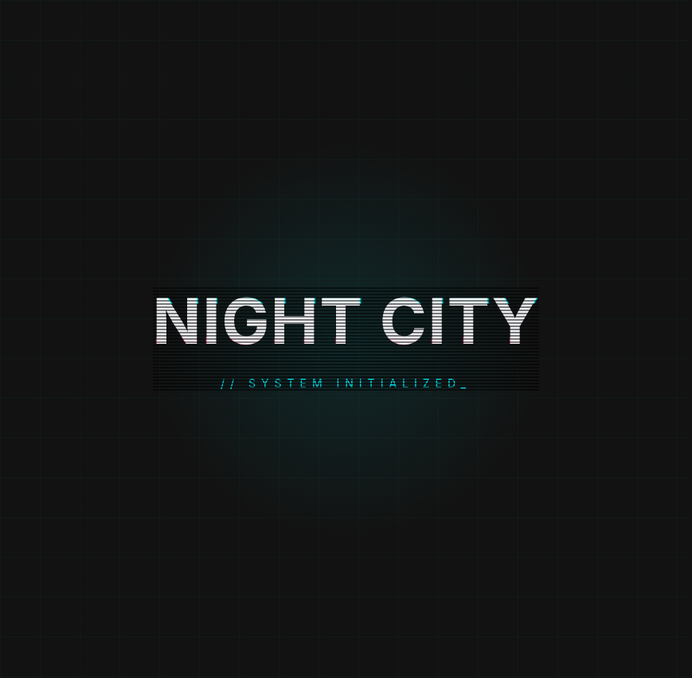
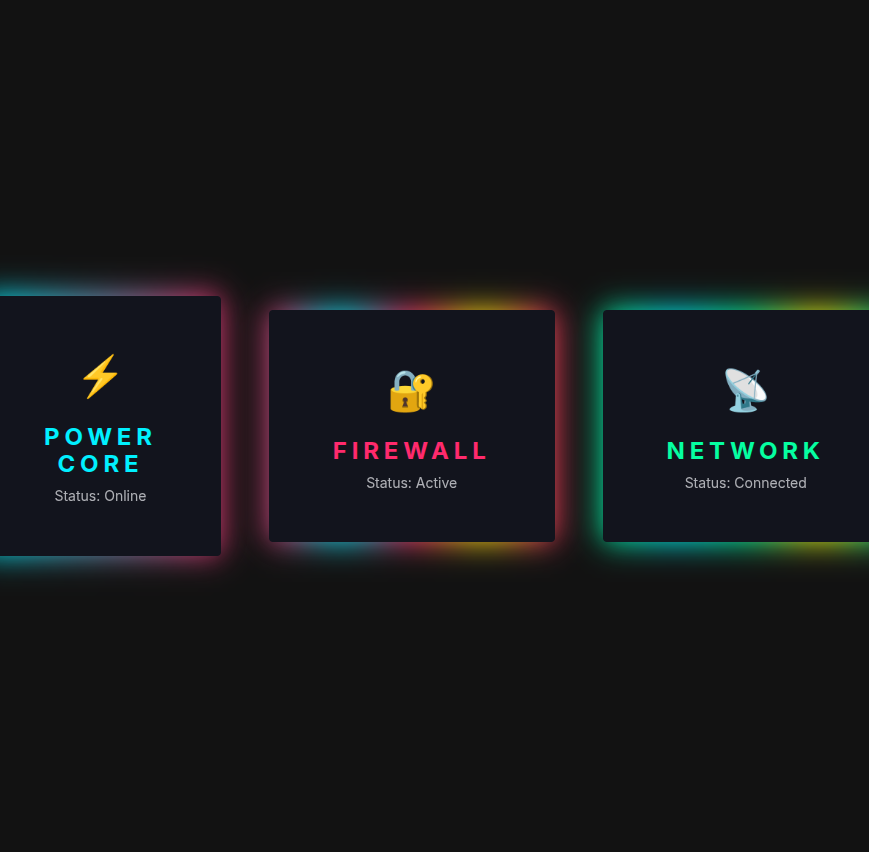
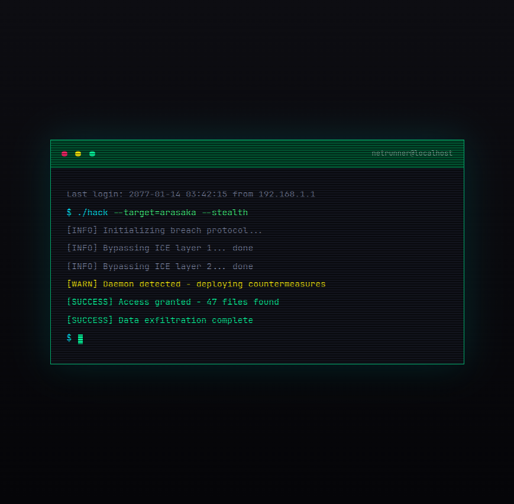
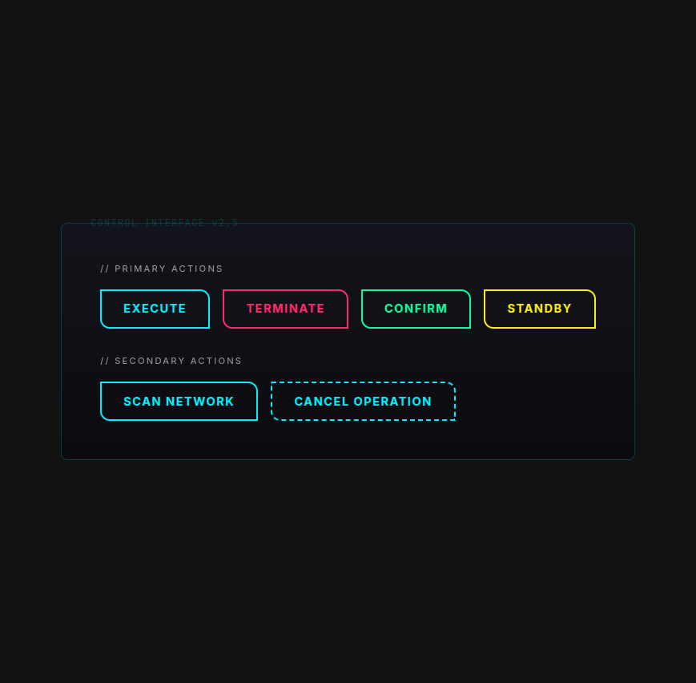
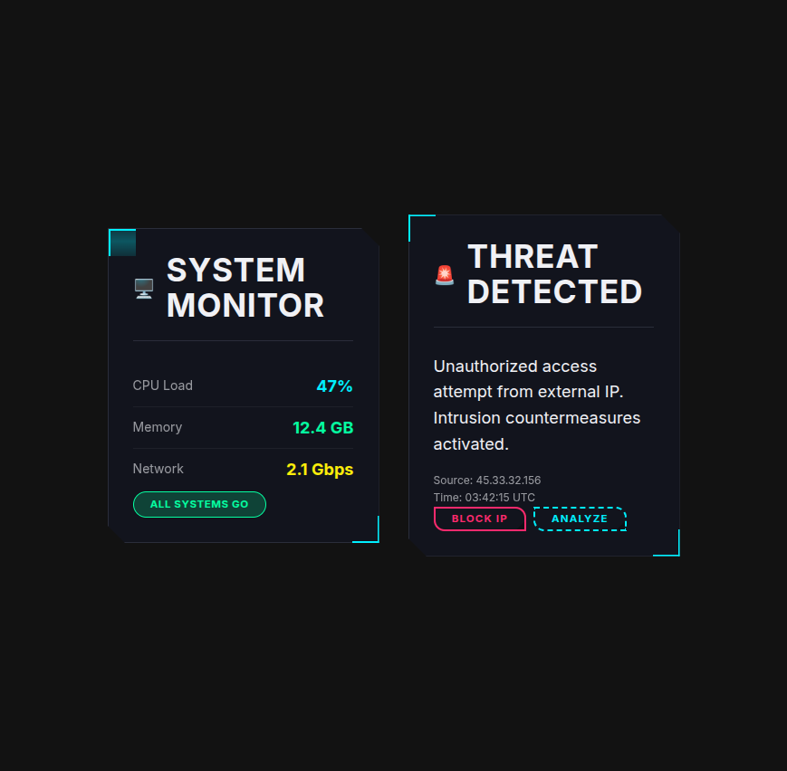
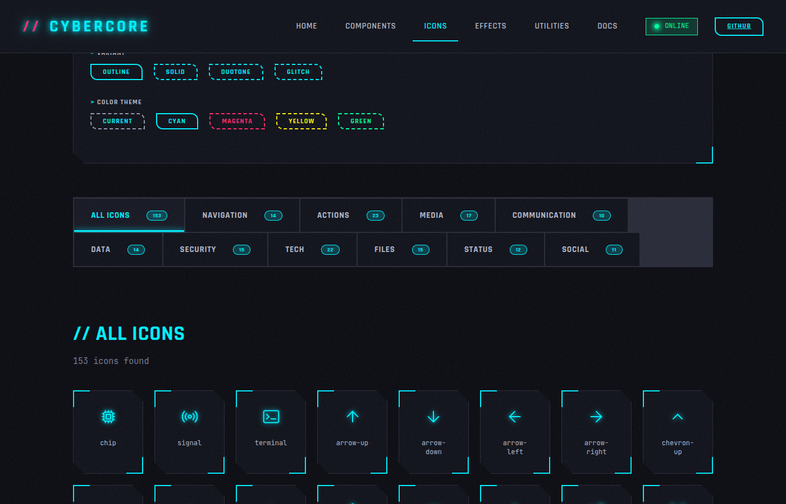
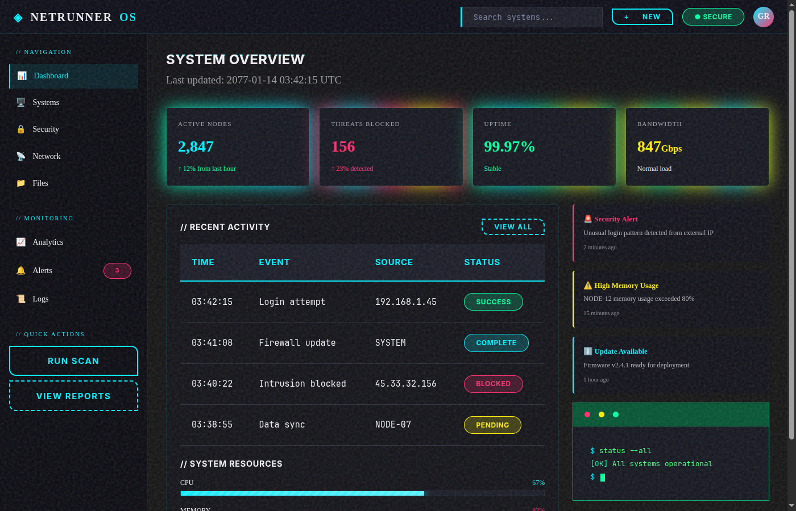

# 🌆 CYBERCORE CSS

<div align="center">


**🎮 A cyberpunk-inspired CSS framework for building futuristic interfaces**

_Inspired by Cyberpunk 2077, Blade Runner, and the neon-soaked streets of Night
City_

[🚀 **Live Demo**](https://sebyx07.github.io/cybercore-css) •
[📖 **Documentation**](https://sebyx07.github.io/cybercore-css/#/docs) •
[💻 **GitHub**](https://github.com/sebyx07/cybercore-css)

</div>

---

## ⚡ Quick Start

### NPM Installation

```bash
npm install cybercore-css
```

### CDN

```html
<link
  rel="stylesheet"
  href="https://unpkg.com/cybercore-css@latest/dist/cybercore.min.css"
/>
```

### Import in Your Project

```scss
// Import everything
@use 'cybercore-css';

// Or import specific modules
@use 'cybercore-css/components/buttons';
@use 'cybercore-css/effects/glitch';
```

---

## 🎯 Features

| Feature             | Description                                  |
| ------------------- | -------------------------------------------- |
| 🎨 **Pure CSS**     | Zero JavaScript dependencies - just CSS/SCSS |
| 🧩 **Modular**      | Import only what you need                    |
| 🌙 **Dark Theme**   | Designed for dark interfaces                 |
| 🔧 **Customizable** | CSS variables for easy theming               |
| ♿ **Accessible**   | Respects `prefers-reduced-motion`            |
| 🤖 **AI-Friendly**  | Simple, predictable class names              |
| ⚡ **Modern CSS**   | CSS Layers, Container Queries, color-mix()   |
| 📱 **Responsive**   | Mobile-first approach                        |
| 🎭 **Icon System**  | 153 cyberpunk-themed SVG icons               |

---

## 📸 Screenshots

<div align="center">

### Glitch Effect



_Glitch text effect with chromatic aberration, scanlines, and animated
distortion_

### Neon Border



_Animated neon glow borders in cyan, magenta, and green variants_

### Terminal



_Cyberpunk terminal component with scanlines and colored output_

### Buttons



_Button variants: primary colors, outline, and ghost styles_

### Cards



_Card components with datastream effect and interactive elements_

### Icons



_153 cyberpunk-themed SVG icons across 10 categories with search and filters_

### Dashboard Showcase



_Full dashboard example combining multiple CYBERCORE components_

</div>

---

## 🎨 Color Palette

```
🔵 Cyan      #00f0ff  →  Primary accent
🔴 Magenta   #ff2a6d  →  Secondary accent
🟡 Yellow    #fcee0a  →  Warning/highlight
🟢 Green     #05ffa1  →  Success states
⚫ Void      #0a0a0f  →  Background
⚪ Chrome    #b4b4b4  →  Neutral tones
```

---

## 🎭 Icons

CYBERCORE CSS includes a complete icon system with 153 cyberpunk-themed SVG
icons across 10 categories, with support for 4 style variants.

### Quick Start

```typescript
// Import the icon utilities
import { renderIcon, getIcon, icons } from 'cybercore-css/icons';

// Render an icon with options
const svg = renderIcon('terminal', { size: 24, color: 'cyan' });

// Get raw SVG string
const terminalSvg = getIcon('terminal');

// Access the full registry
console.log(icons.terminal.svg);
```

### Tree-Shakeable Imports

```typescript
// Import only the icons you need
import {
  ChipIcon,
  TerminalIcon,
  SignalIcon,
} from 'cybercore-css/icons/individual';
```

### Icon Categories

| Category      | Icons | Description                    |
| ------------- | ----- | ------------------------------ |
| Navigation    | 14    | Arrows, chevrons, menus        |
| Actions       | 23    | Edit, delete, copy, download   |
| Media         | 17    | Play, pause, volume controls   |
| Communication | 10    | Messages, mail, notifications  |
| Data          | 14    | Charts, database, cloud        |
| Security      | 15    | Lock, shield, user, auth       |
| Tech          | 22    | Terminal, code, chip, settings |
| Files         | 15    | File types, folders            |
| Status        | 12    | Info, warning, error, success  |
| Social        | 11    | Heart, star, bookmark, share   |

### Style Variants

- **outline** - Stroke-based, default style (1.5px stroke)
- **solid** - Filled icons for emphasis
- **duotone** - Two-tone with primary/secondary colors
- **glitch** - Animated/glitchy variant for cyber effects

```typescript
// Use different variants
renderIcon('shield', { variant: 'solid' });
renderIcon('terminal', { variant: 'duotone' });
```

> 📖 **Full documentation:**
> [Icon System Docs](https://sebyx07.github.io/cybercore-css/#/docs/icons)

---

## 🧩 Components

### Buttons

```html
<!-- Primary button -->
<button class="cyber-btn">EXECUTE</button>

<!-- Color variants -->
<button class="cyber-btn cyber-btn--magenta">DANGER</button>
<button class="cyber-btn cyber-btn--yellow">CAUTION</button>
<button class="cyber-btn cyber-btn--green">CONFIRM</button>

<!-- Ghost style -->
<button class="cyber-btn cyber-btn--ghost">GHOST</button>
```

### Cards

```html
<div class="cyber-card">
  <div class="cyber-card__header">
    <h3 class="cyber-card__title">SYSTEM STATUS</h3>
  </div>
  <div class="cyber-card__body">All systems operational.</div>
</div>

<!-- Interactive card -->
<div class="cyber-card cyber-card--interactive">
  <!-- Glows on hover! -->
</div>

<!-- Holographic effect -->
<div class="cyber-card cyber-card--holo">
  <!-- Animated shimmer! -->
</div>
```

### Inputs

```html
<input type="text" class="cyber-input" placeholder="Enter data..." />

<!-- With field wrapper -->
<div class="cyber-field">
  <label class="cyber-field__label">USERNAME</label>
  <input type="text" class="cyber-input" />
  <span class="cyber-field__helper">Enter your handle</span>
</div>
```

### Terminal

```html
<div class="cyber-terminal">
  <div class="cyber-terminal__chrome">
    <div class="cyber-terminal__dots">
      <span class="cyber-terminal__dot"></span>
      <span class="cyber-terminal__dot"></span>
      <span class="cyber-terminal__dot"></span>
    </div>
    <span class="cyber-terminal__title">system.exe</span>
  </div>
  <div class="cyber-terminal__body">
    <div class="cyber-terminal__line">
      <span class="cyber-terminal__prompt">$</span>
      <span class="cyber-terminal__command">hack the planet</span>
    </div>
  </div>
</div>
```

### More Components

- 🏷️ **Badges** - Status indicators and labels
- ⚠️ **Alerts** - Notifications and messages
- 📊 **Tables** - Data grids with cyber styling
- 🔄 **Progress** - Loading bars and indicators
- 🗂️ **Tabs** - Tabbed navigation
- 📋 **Modal** - Dialog windows
- ⏳ **Spinner** - Loading animations
- 💀 **Skeleton** - Loading placeholders
- 🧭 **Nav** - Navigation bars

---

## ✨ Effects

### Glitch Text

```html
<h1 class="cyber-glitch" data-text="GLITCH">GLITCH</h1>
```

### Neon Border

```html
<div class="cyber-neon-border">Glowing border effect</div>

<div class="cyber-neon-border cyber-neon-border--magenta">Magenta variant</div>
```

### Scanlines

```html
<div class="cyber-scanlines">CRT monitor effect</div>
```

### Noise Overlay

```html
<div class="cyber-noise">Static noise texture</div>
```

### Datastream

```html
<div class="cyber-datastream">Animated light sweep</div>
```

---

## 🛠️ Utilities

### Text Colors

```html
<span class="cyber-text-cyan">Cyan text</span>
<span class="cyber-text-magenta">Magenta text</span>
<span class="cyber-text-yellow">Yellow text</span>
<span class="cyber-text-green">Green text</span>
```

### Text Glow

```html
<span class="cyber-text-glow">Glowing text</span>
```

### Display

```html
<div class="cyber-d-flex">Flexbox</div>
<div class="cyber-d-grid">Grid</div>
<div class="cyber-d-none">Hidden</div>
```

### Spacing

```html
<div class="cyber-m-md">Margin medium</div>
<div class="cyber-p-lg">Padding large</div>
<div class="cyber-gap-sm">Gap small</div>
```

---

## 🎛️ Customization

### CSS Variables

Override any variable in your own CSS:

```css
:root {
  /* Change primary accent */
  --cyber-cyan-500: #00ffaa;

  /* Adjust spacing */
  --space-md: 1.5rem;

  /* Modify glow intensity */
  --glow-cyan: 0 0 10px #00ffaa, 0 0 30px rgba(0, 255, 170, 0.5);
}
```

### SCSS Configuration

```scss
// Override before importing
$cyber-primary: #00ffaa;
$cyber-font-mono: 'JetBrains Mono', monospace;

@use 'cybercore-css' with (
  $primary-color: $cyber-primary,
  $font-mono: $cyber-font-mono
);
```

---

## 📁 Project Structure

```
cybercore-css/
├── src/scss/
│   ├── cybercore.scss        # Main entry point
│   ├── core/
│   │   ├── _variables.scss   # Design tokens
│   │   ├── _reset.scss       # CSS reset
│   │   ├── _base.scss        # Base styles
│   │   └── _typography.scss  # Type system
│   ├── components/
│   │   ├── _buttons.scss
│   │   ├── _cards.scss
│   │   ├── _inputs.scss
│   │   └── ... (14 components)
│   ├── effects/
│   │   ├── _glitch.scss
│   │   ├── _neon-border.scss
│   │   └── ... (6 effects)
│   └── utilities/
│       ├── _display.scss
│       ├── _flex.scss
│       └── ... (8 utilities)
└── dist/
    ├── cybercore.css         # Full build
    └── cybercore.min.css     # Minified
```

---

## 🧪 Development

```bash
# Install dependencies
npm install

# Start dev server with demo site
npm run dev

# Build CSS
npm run build

# Run tests
npm run test

# Lint
npm run lint

# Format
npm run format
```

---

## 🚀 Browser Support

| Browser | Version |
| ------- | ------- |
| Chrome  | 105+    |
| Firefox | 121+    |
| Safari  | 15.4+   |
| Edge    | 105+    |

_Requires CSS Layers, color-mix(), and container queries support_

---

## 📜 License

MIT License - Use it, hack it, share it.

---

## 🔗 Related Projects

- **[CYBERCORE CHARTS](https://github.com/sebyx07/cybercore-charts)** -
  Zero-dependency SVG chart library with the same cyberpunk aesthetic. Neon
  glows, dark themes, and AI-optimized.

---

## 🤝 Contributing

1. Fork the repo
2. Create your feature branch (`git checkout -b feature/amazing-feature`)
3. Commit your changes (`git commit -m 'Add amazing feature'`)
4. Push to the branch (`git push origin feature/amazing-feature`)
5. Open a Pull Request

---

<div align="center">

**⚡ Built for the future. Styled for Night City. ⚡**

[🚀 Demo](https://sebyx07.github.io/cybercore-css) •
[📖 Docs](https://sebyx07.github.io/cybercore-css/#/docs) •
[🐛 Issues](https://github.com/sebyx07/cybercore-css/issues) •
[💬 Discussions](https://github.com/sebyx07/cybercore-css/discussions)

</div>

---

```
  ██████╗██╗   ██╗██████╗ ███████╗██████╗  ██████╗ ██████╗ ██████╗ ███████╗
 ██╔════╝╚██╗ ██╔╝██╔══██╗██╔════╝██╔══██╗██╔════╝██╔═══██╗██╔══██╗██╔════╝
 ██║      ╚████╔╝ ██████╔╝█████╗  ██████╔╝██║     ██║   ██║██████╔╝█████╗
 ██║       ╚██╔╝  ██╔══██╗██╔══╝  ██╔══██╗██║     ██║   ██║██╔══██╗██╔══╝
 ╚██████╗   ██║   ██████╔╝███████╗██║  ██║╚██████╗╚██████╔╝██║  ██║███████╗
  ╚═════╝   ╚═╝   ╚═════╝ ╚══════╝╚═╝  ╚═╝ ╚═════╝ ╚═════╝ ╚═╝  ╚═╝╚══════╝
```
